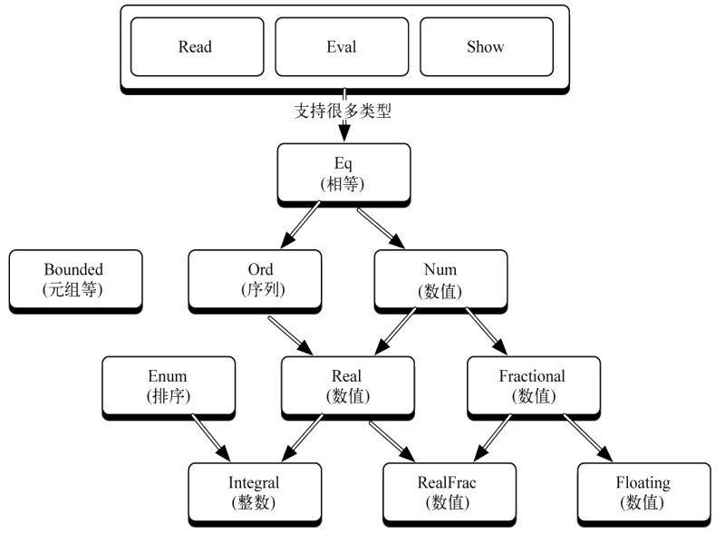

## 类与类型

### 自定义类型

- 用`data`指定有限的值列表，得到*类型构造器*
- 用`type`组合已有的类型

### 函数与多态

- 在函数类型声明中用`a`指代任意类型，从而定义多态的函数。

`cards.hs`

- 在类型定义中用`a`指代任意类型，从而定义多态的数据类型。

`triplet.hs`

### 递归类型

在一个类型构造器中可以包含多个*数据构造器*，从而以不同方式定义该类型的变量。在其中一个数据构造器中递归包含这个类型的数据构造器，可以定义递归类型。

`tree.hs`

数据构造器可以用于模式匹配，从而获取用`let`给变量赋值时输入的数据。

### 类

因为不涉及数据，它不是面向对象编程中的那个类。在Haskell中，类精细地控制多态和重载。 类定义了哪些操作可以在哪些输入上进行。

继承：类中定义若干函数，如果一个类型支持其中的函数，则该*类型*是类的一个实例，类中的其它函数也被提供给该类型。

## monad

为了表达命令式编程中容易解决的顺序结构和程序状态的累积，需要使用monad类型构造器。monad中的函数把不同的应用函数包装串联起来，实现不同的计算策略。

